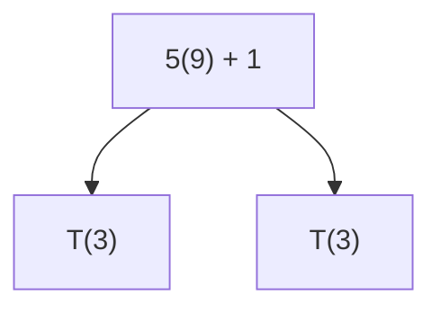
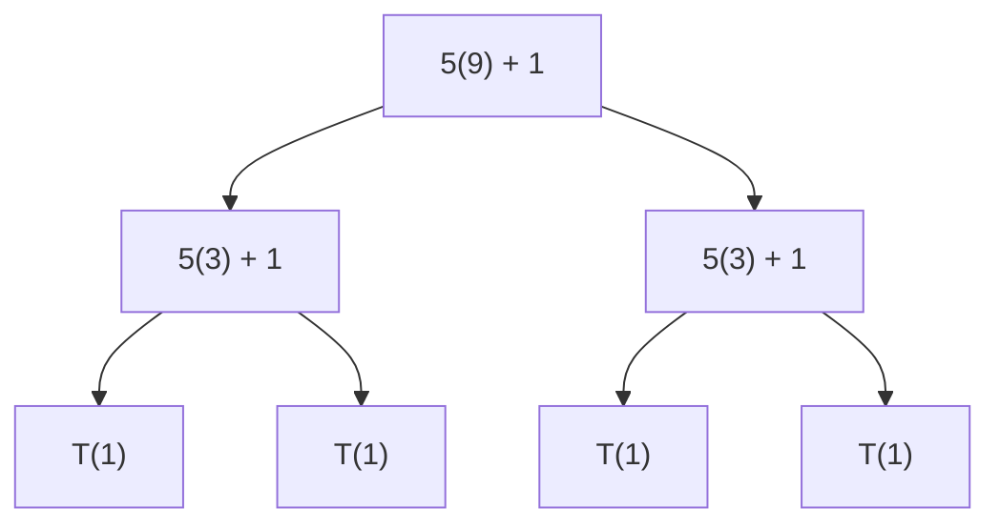
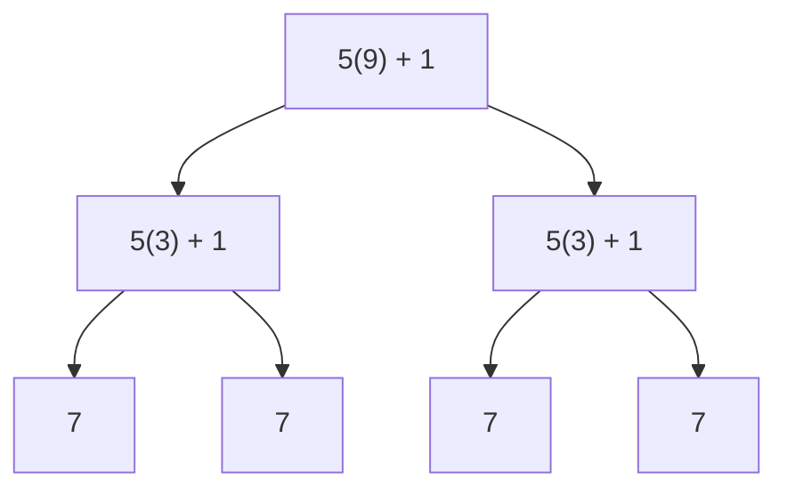
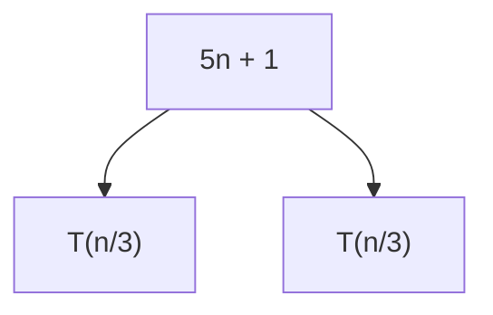
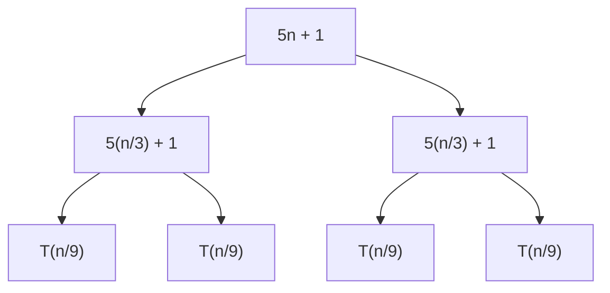

# Recurrence Relations

Goal: Build a new tool which we can use to analyze time complexity.

### Inspiration

Suppose T(n) = time for [bubble sort](/04_bubble_sort.md) for a list of length n,

Our definition of bubble sort can be written as
1. Iterate through once, swapping elements as we go, correctly positioning n-1
2. Do bubble sort on 0..n-2

We can then write
$T(n) = cn + T(n-1)$, where cn is the time step 1 takes, and T(n-1) is the time step 2 takes

Suppose T(n) = time for [binary search](/08_binary_search.md) for a list of length n,

Our definition of binary sort is
1. Check the middle element
    2. If greater then needle, search the 0 to middle-1
    2. If less then needle, search middle+1 to end 

We can then say
$T(n) = c + T(\frac{n}{2})$ (kind of, the T(n/2) isn't always called (element found?))

Suppose T(n) = Time for [MCS](/03_maximum_contiguous_sum.md) divide and conquer, then we can say

$T(n) = cn + 2T(\frac{n}{2})$

## Info

Defn) A *recurrence relation* for T(n) is an expression for T(n) in terms of T(<n) a perhaps other expressions involving n

ex) $T(n) = 3T(\frac{n}{2}) + 5n$
ex) $T(n) = 2T(\frac{n}{5}) + \lg(n) + 1$
ex) $T(n) = T(n - 2) + 3$
ex) $T(n) = T(\frac{n}{2}) + T(\frac{n}{4}) + n + 1$

Comments
- Common to have floors or ceils, ex: $T(n) = 2T(\lceil\frac{n}{2}\rceil))$
- Common to have many bases cases, ex: $T(1) = 3$

### Uses

- Finding specific values of T(n)
- Finding a closed form for T, into which we can plug in n and get a value (in constant time).
- Finding asymptotic time complexity

#### Specific Value
ex)

$$
T(n) = 2T(\lfloor\frac{n}{3}\rfloor) + n + 1, T(0) = 5 
\\
\text{then }T(1) = 2T(0) + 1 + 1 = 12 
\text{then }T(2) = 2T(0) + 2 + 1 = 13 
\text{then }T(3) = 2T(1) + 3 + 1 = 28 
$$

#### Finding a closed form - digging down
ex)
$$
T(n) = T(\frac{n}{2}), T(1) = 5 
\\
T(n) = T(\frac{n}{2}) + 3
T(n) = (T(\frac{n}{4}) + 3) + 3 = T(\frac{n}{4}) + 6 
T(n) = (T(\frac{n}{8}) + 3) + 6 = T(\frac{n}{8}) + 9 
\dots
\\
\text{We can then say} 
T(n) = T(\frac{2}{n^k}) + 3k 
\\
T(1) = 5 \text{when} \frac{n}{2^k} = 1 
k = \lg{n} 
\\
T(n) = T(1) + 3\lg(n)
T(n) = 5 + 3\lg(n)
$$

ex)
$$
T(n) = T(n-1) + n, T(0) = 3
\\
T(n) = T(n-1) + n
T(n) = T(n-2) + (n-1) + n
T(n) = T(n-2) + (n-1) + n
\dots
\\
\text{We can then say} 
T(n) = T(n-k) + (n - k + 1) +  \dots + n
\\
T(0) = 3 \text{when} n-k = 0
k = n
\\
T(n) = 3 + (n - n + 1) + \dots + n
T(n) = 3 + 1 + \dots + n
T(n) = 3 + \sum_{i=1}^{n} i
T(n) = 3 + \frac{n \times (n + 1)}{2}
$$

Note: Finding T(n) makes finding asymptotic time complexities easy

1. First example: $T(n) = \theta(\lg n)$
2. Second example: $T(n) = \theta(n^2)$

For certain recurrence relations, we can go from recurrence relations to θ(f(n))

## Trees

Two reasons to represent RR as trees
1. Proof of the Master Theorem* uses trees
2. Can simplify the process of finding a T(n)

Intro step: $T(n) = 2T(\frac{n}{3}) + 5n + 1, T(1) = 7$

We want T(9),
$T(9) = 2T(3) + 5(9) + 1$

The sum of this tree is T(9).
Now let's plug in T(3) = 2T(1) + 5(3) + 1

Finally, plug in T(1) = 7

We can use the same idea to a general formula for T(n)

again

We can see this tree continues until $n/3^k = 1$, where k is the depth of the tree. 

The sum of the this tree is also T(n). (!)

We can then use this to say,

$$
\begin{aligned}
k = \log_3(n) \\
T(n) = 2^{k} \times 7 + \sum_{i=0}^{k-1} 2^i(5(\frac{n}{3^i}) + 1) \\
\text{Simplify the sum with} \\
\sum_{i=0}^{k-1} 5n(\frac{2}{3})^i + 2^i \\
5n \times \frac{1 - (\frac{2}{3})^k}{1 - \frac{2}{3}} + 2^k - 1 \\
\\
\text{Subbing this in for the sum} \\
8(2^{k}) + 15n(1 - (\frac{2}{3})^k) - 1 \\
\text{Since } k = \log_3(n), \\
8(2^{\log_3(n)}) + 15n(1 - \frac{2^{\log_3(n)}}{n}) - 1 \\
-7(2^{\log_3(n)}) + 15n - 1 \\
\text{By the change of base formula, } 2^{\log_3(n)} = 2^{\frac{\lg n}{\lg 3}} = n^{\frac{1}{\lg 3}} \\
-7n^{\frac{1}{\lg 3}} + 15n - 1
\end{aligned}
$$

As $\frac{1}{\lg 3} < 1$, n is the dominant term.

So T(n) = θ(n).

Let's generalize:

For an equation $T(n) = aT(\frac{n}{b}) + f(n)$
observe: 
- a = \#children each node has
- b = factor each child decreases by
- continue until ...

## Master Theorem

The Master Theorem can easily and quickly find θ for many recurrence relations of the form 
$T(n) = aT(n/b) + f(n), a, b \in \mathbb{Z}, a \ge 1, b \ge 2$

Suppose we have a recurrence relation of this form

Case 1: if $f(n) = O(n^c)$ for some $c \ge 0$ and $\log_b(a) > c$ then T(n) = $\theta(n^{\log_b(a)})$
Case 2: if $f(n) = \theta(n^c)$ for some $c \ge 0$ and $\log_b(a) = c$ then T(n) = $\theta(n^{\log_b(a)} \times \lg n)$
Case 3: if $f(n) = \Omega(n^c)$ for some $c \ge 0$ and $\log_b(a) < c$ then T(n) = $\theta(f(n))$, given f(n) satifies a regularity condition

Case 2f: if $f(n) = \theta(n^c\lg^k(n))$ for some $c \ge 0$ and $\log_b(a) = c$ then $T(n) = \theta(n^{\log_b a} \times \lg^{k+1}n)$

Notes: 
- $\lg^k(n)\text{ means }(\lg n)^k$
- case 2 is a special case of 2f, when k=0
- Regularity condition of case 3 is ignored in this class, ALL examples/problems will have regular f(n)
- obs: θ -> O, Ω so we could have any case
- Idea: find $\theta(n^c)$ and compare $\log_b(a)$, use the asymptotic time complexity that matches

There are a lot of examples, sO I'm also gonna explain the idea:
- Solve for a, b, c
- Find $\log_a(b)$
- Now, if the log = c, apply θ version
- Otherwise, use a O or Ω version, keep in mind you can change the c as these are not as restrictive as θ

### Where doesn't this theorem work?
- Non-geometric relations: $T(n) = 2T(n - 1) + n$
- Multiple distinct recurrences: $T(n) = T(\frac{n}{4}) + T(\frac{3n}{4}) + n$
- Unworkable restrictions: 
    - $T(n) = 16T(\frac{n}{4}) + f(n)$ where $f(n) = O(n^2)$
    - See that $\log_4(16) = 2 \ngtr 2$, so we cannot apply the O case, but it's all the info we have

Ex)

$$
T(n) = 8T(\frac{n}{2}) + n^2 + 1
f(n) = n^2 + 1 = \theta(n^2)
\\
a = 8, b = 2, c = 2
\log_2(8) = 3 > 2
\\
\text{Apply the O(n) case}
T(n) = \theta(n^{\log_b a}) = \theta(n^3)
$$

$$
T(n) = 9T(\frac{n}{3}) + n^2 + n\lg n
f(n) = n^2 + n\lg n = \theta(n^2)
\\
a = 9, b = 3, c = 2
\log_3(9) = 2 = 2
\\
\text{Apply the θ(n) case}
T(n) = \theta(n^{\log_b a} \times \lg n) = \theta(n^2\lg n)
$$

$$
T(n) = 125T(\frac{n}{5}) + n^3\lg n + 7
f(n) = n^3\lg n + 7 = \theta(n^3\lg n)
\\
a = 125, b = 5, c = 3
\log_5(125) = 3 = 3
\\
\text{Apply the generalized θ(n) case}
T(n) = \theta(n^{\log_b a} \times \lg^2 n) = \theta(n^3\lg^2n)
$$

$$
T(n) = 5T(\frac{n}{25}) + n + 1
f(n) = n + 1 = \theta(n)
\\
a = 5, b = 25, c = 1
\log_25(5) = \frac{1}{2} < 1
\\
\text{Apply the Ω(n) case}
T(n) = \theta(n + 1) = \theta(n)
$$

More examples)

$$
T(n) = 3T(\frac{n}{2}) + \lg n
f(n) = \lg n = \theta(\lg n)
\\
a = 3, b = 2
\log_2(3) \approx 1.5 \ne 0
\text{Because of this, we cannot apply our generalized θ(n) case}
\text{However, notice that}
f(n) = \lg n = O(n)\text{ and } \log_2(3) > 1
\\
\text{Using this, apply the O(n) case}
T(n) = \theta(n^{\log_2(3)})
$$

$$
T(n) = 9T(\frac{n}{2}) + n^4\lg n
f(n) = n^4\lg n = \theta(n^4\lg n)
\\
a = 9, b = 2
\log_2(9) \approx 3 \ne 4
\text{Because of this, we cannot apply our generalized θ(n) case}
\text{Our log is around 3, but the power is 4, so we cannot apply the O(n) case either!}
f(n) = n^4\lg n = \Omega(n^4)\text{ and } \log_2(9) < 4
\\
\text{Using this, apply the Ω(n) case}
T(n) = \theta(n^4\lg n)
$$

$$
T(n) = 16T(\frac{n}{2}) + n^3\lg n
f(n) = n^3\lg n = \theta(n^3\lg n)
\\
a = 2, b = 16
\log_2(16) = 4 \ne 3
\text{What inequality can we make with our power and log?}
f(n) = n^3\lg n = O(n^{3.1})
\\
\text{Using this, apply the O(n) case}
T(n) = \theta(n^4)
$$
